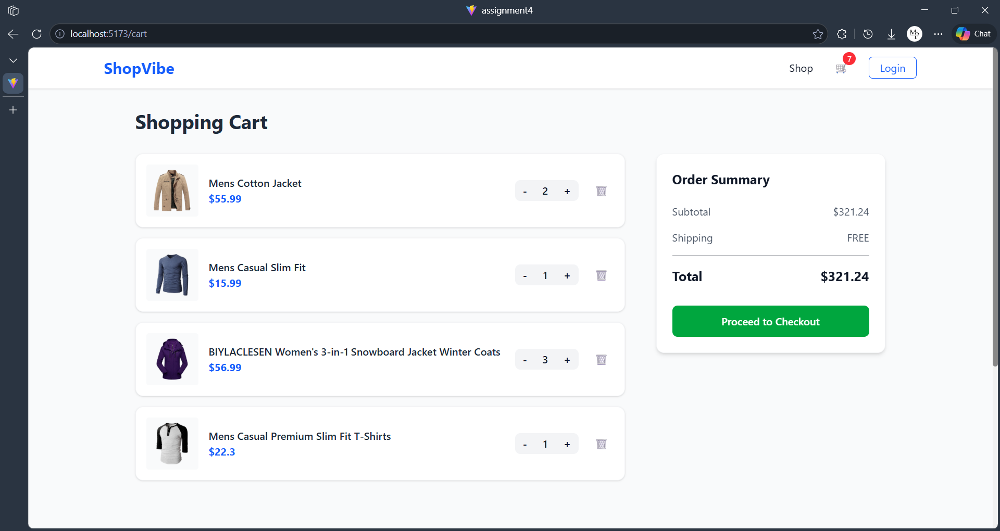

# ShopVibe – React E-Commerce

**ShopVibe** is a responsive, modern E-Commerce application built using **React.js** and **Tailwind CSS**. This project was developed as a university assignment to demonstrate proficiency in functional components, state management via Context API, and responsive UI design.

---

## ✨ Features

* **Product Listing:** Fetches 20 dynamic products from the FakeStoreAPI.
* **Search & Filter:** Real-time search by product title and category-based filtering.
* **Persistent Shopping Cart:** * Add/Remove items.
* Dynamic quantity updates.
* State persistence using **Local Storage**.


* **Responsive Design:** Fully optimized for Mobile, Tablet, and Desktop using Tailwind’s grid system.
* **Global State:** Centralized cart logic using **React Context API**.
* **Modern UI:** Features a custom Navbar with a live cart counter, a professional Footer, and interactive Product Cards.

---

## 🛠️ Tech Stack

* **Frontend Framework:** React.js (Vite)
* **Styling:** Tailwind CSS v4
* **Routing:** React Router DOM
* **Data Source:** [FakeStoreAPI](https://fakestoreapi.com/)
* **Icons:** Lucide-React / Emoji UI

---




## 📂 Folder Structure

The project follows a modular architecture for better maintainability:

```text
src/
├── components/
│   ├── common/       # Reusable UI (Button, Input, Loader, Rating)
│   ├── layout/       # Global Layout (Navbar, Footer)
│   ├── product/      # Product Display logic (ProductCard, ProductGrid)
│   └── cart/         # Shopping Cart components (CartItem, CartSummary)
├── context/          # CartContext (Global State Management)
├── pages/            # Page-level components (Home, Products, Detail, Cart, Login)
└── App.jsx           # Main Routing & Provider setup

```

---

## 🚀 Getting Started

Follow these steps to run the project locally on your machine.

### 1. Clone the repository

```bash
git clone <https://github.com/Mughal-Prince123/Web_App_Assignment_4_Roll_043>
cd Web_App_Assignment_4_Roll_043

```

### 2. Install Dependencies

```bash
npm install

```

### 3. Start Development Server

```bash
npm run dev

```

The application will be available at `http://localhost:5173`.

---

## 📝 Functional Requirements Met

1. **Pages:** Home, Product Listing, Product Details, Cart, and Login.
2. **Components:** Implemented 10+ reusable components including Modal-like structures, Loaders, and Grids.
3. **Hooks:** Utilized `useState`, `useEffect`, `useContext`, and `useParams`.
4. **Routing:** Managed via `react-router-dom` with dynamic URL segments for product details.
5. **State Logic:** Complete Add-to-Cart and quantity update functionality.

---

## 👤 Author

* **Name:** Ahamd Ejaz
* **Roll Number:** 043
* **Semester:** 5th – Web Development

**Is there anything else you need before you push this to GitHub?**
